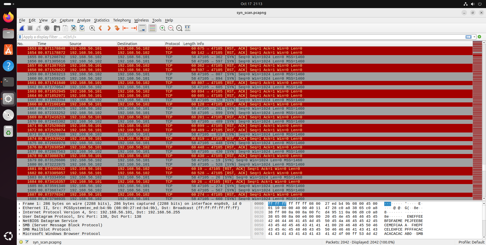
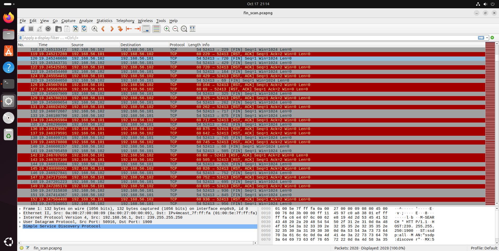
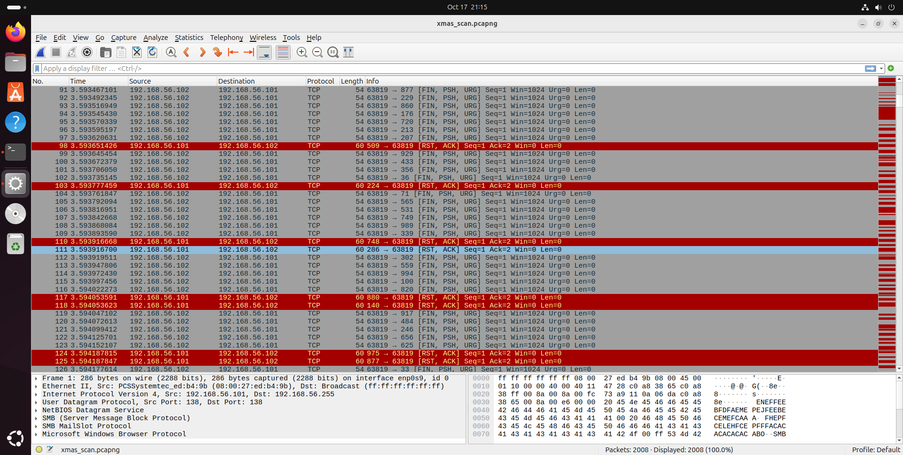
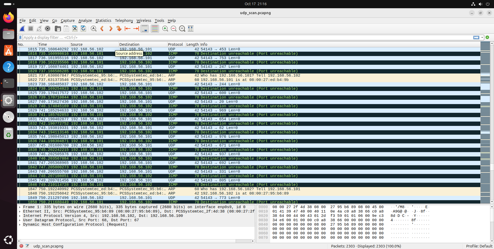

#Задание №1
с помощью nmap были обнаружены следующие открытые порты и сетевые службы:

 FTP (vsftpd 2.3.4)

 SSH (OpenSSH 4.7p1 Debian 8ubuntu1)

 Telnet (Linux telnetd)

 SMTP (Postfix smtpd)

 DNS (ISC BIND 9.4.2)

 HTTP (Apache httpd 2.2.8)

 RPC (RPCbind)

 SMB/CIFS (Samba smbd 3.x)

 NFS (Network File System)

 MySQL (MySQL 5.0.51a)

 VNC (VNC protocol)

 IRC (UnrealIRCd 3.2.8.1)

 DistCC (Distributed Compiler Daemon)

 Rlogin (rlogind)

 Exec (rexecd)

 Login (rlogind)

#Обнаруженные уязвимости:

1. vsftpd 2.3.4 Backdoor Command Execution
Ссылка: https://www.exploit-db.com/exploits/49757

2. UnrealIRCd 3.2.8.1 Backdoor Command Execution
Ссылка: https://www.exploit-db.com/exploits/16922

3. DistCC Daemon Command Execution
Ссылка: https://www.exploit-db.com/exploits/9915

#Задание №2

#SYN-сканирование:
Описание: Отправляет SYN-пакеты на целевые порты и анализирует ответы.
Сетевой трафик: Инициируется неполное TCP-соединение (полуоткрытое сканирование). Не завершается полное трехстороннее рукопожатие.
Использование: Быстрое и малозаметное сканирование, часто не фиксируется простыми системами обнаружения.

#FIN-сканирование:
Описание: Отправляет FIN-пакеты, которые обычно используются для завершения TCP-соединений.
Сетевой трафик: Пакеты с установленным флагом FIN без предварительного установления соединения.
Использование: Скрытное сканирование, которое может обходить некоторые брандмауэры и системы обнаружения.

#Xmas-сканирование:
Описание: Отправляет пакеты с установленными флагами FIN, PSH и URG.
Сетевой трафик: "Украшенные" пакеты (отсюда название "Xmas"), которые могут вызывать специфические реакции от целевого хоста.
Использование: Для выявления различий в стековых реализациях и обхода некоторых фильтров.

#UDP-сканирование:
Описание: Отправляет UDP-пакеты на целевые порты и анализирует ответы.
Сетевой трафик: Без установления соединения, так как UDP — протокол без установления соединения.
Использование: Для обнаружения открытых UDP-сервисов, но может быть медленным из-за возможной фильтрации ICMP-сообщений.

#Как отвечает сервер?

#SYN-сканирование:
Открытый порт: Сервер отвечает пакетом SYN-ACK.
Закрытый порт: Сервер отвечает пакетом RST.
Фильтруется: Отсутствие ответа или получено ICMP-сообщение.

#FIN-сканирование:
Открытый порт: Нет ответа от сервера (согласно RFC 793).
Закрытый порт: Сервер отвечает пакетом RST.
Фильтруется: Отсутствие ответа или получено ICMP-сообщение.

#Xmas-сканирование:
Открытый порт: Нет ответа от сервера.
Закрытый порт: Сервер отвечает пакетом RST.
Фильтруется: Отсутствие ответа или получено ICMP-сообщение.

#UDP-сканирование:
Открытый порт: Обычно нет ответа (может быть ответ, если сервис активен и настроен отвечать).
Закрытый порт: Сервер отвечает ICMP-сообщением "порт недоступен" (тип 3, код 3).
Фильтруется: Отсутствие ответа или другие ICMP-сообщения (например, "доступ запрещен").

